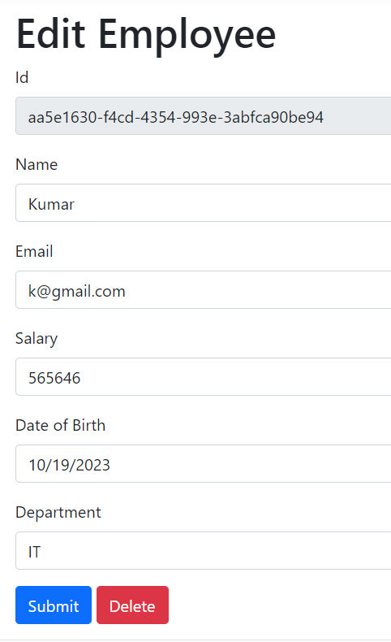
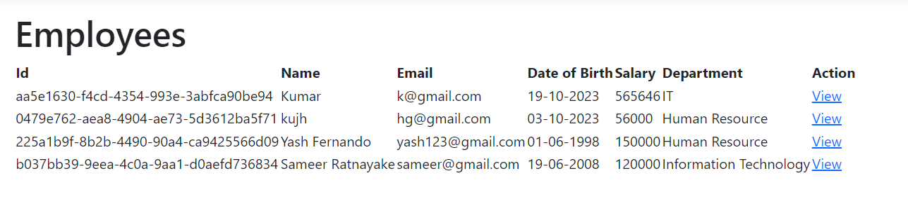

# CRUD in C# .NET

Simple C# .NET Core MVC Project for beginners.

## Introduction

This project is a C# .NET Core MVC application that demonstrates CRUD (Create, Read, Update, Delete) operations for managing data. It's a simple web application built using Entity Framework for data access and ASP.NET Core MVC for the user interface.

## Features

- Create new records in the database.
- Read and view existing records.
- Update records with new information.
- Delete records from the database.

## Getting Started

To run this project on your local machine, follow these steps:

1. Clone this repository to your local system.
2. Open the project in Visual Studio or your preferred IDE.
3. Build and run the application.
4. Access the application through your web browser at `http://localhost:5000`.

## Screenshots

The project includes the following screenshots to provide a visual overview of the application's user interface.

